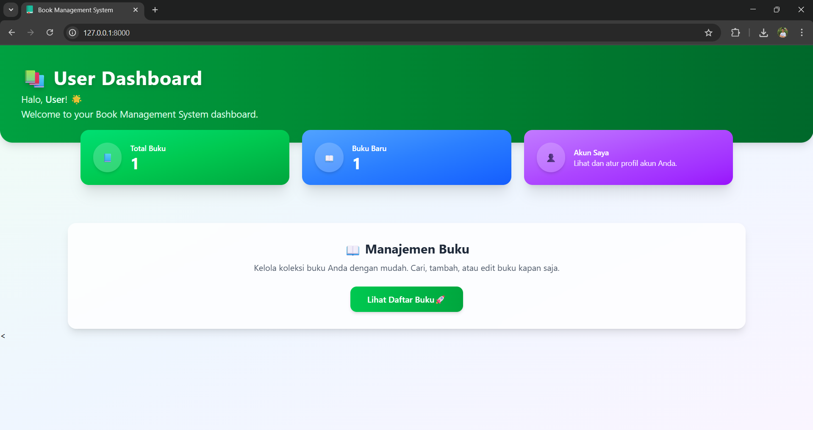
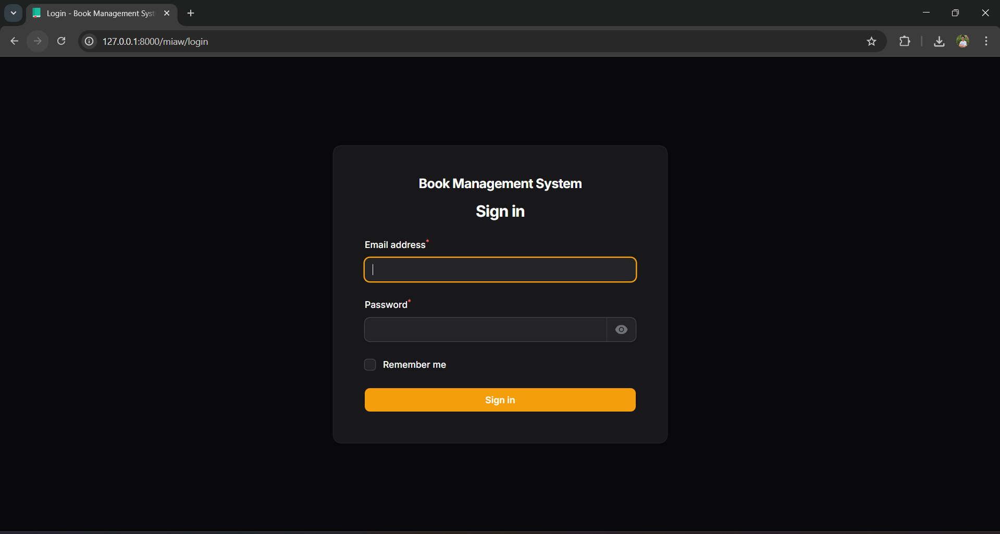
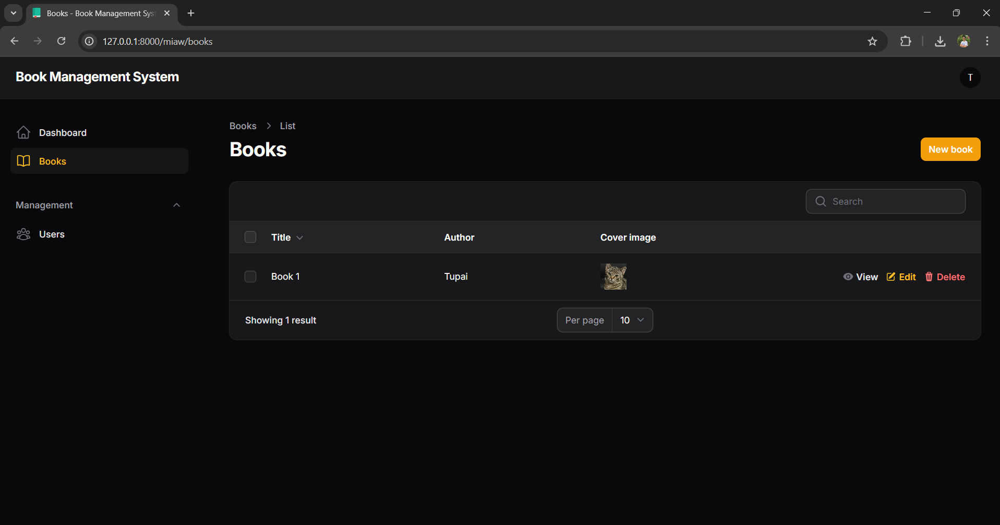
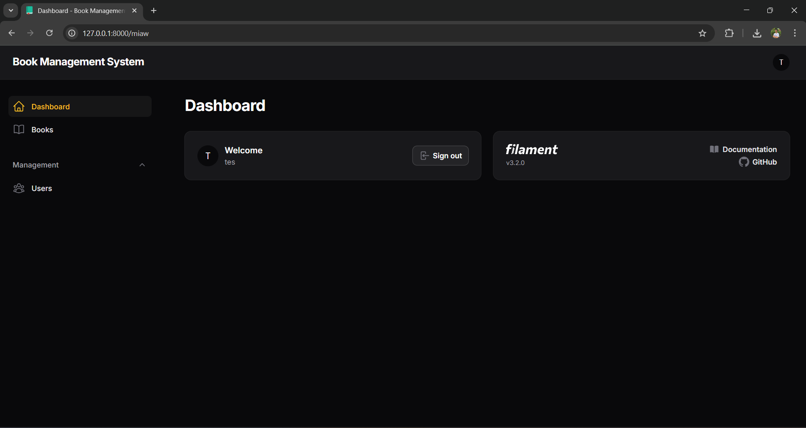

<a id="readme-top"></a>

<br />
<div align="center">
  

  <h3 align="center">Book Management System</h3>

  <p align="center">
    A simple web-based application to manage books with user and admin panels
    <br />
    <a href="https://github.com/RahsyaBenova/book-management-system"><strong>Explore the docs »</strong></a>
    <br />
    <br />
    <a href="https://github.com/RahsyaBenova/book-management-system">View Demo</a>
    ·
    <a href="https://github.com/RahsyaBenova/book-management-system/issues/new?labels=bug&template=bug-report---.md">Report Bug</a>
    ·
    <a href="https://github.com/RahsyaBenova/book-management-system/issues/new?labels=enhancement&template=feature-request---.md">Request Feature</a>
  </p>
</div>

---

## About The Project



The **Book Management System** is a Laravel + Livewire application with a modern UI for users and a FilamentPHP admin panel for administrators.

---

## Built With

<p align="center">
  
  
  
  
  
</p>

---

## Installation


1. Clone the repository

   ```sh
   git clone https://github.com/RahsyaBenova/book-management-system-System.git

2. Navigate to the project directory
   ```sh
   cd book-management-system-System
3. Install frontend dependencies
   ```sh
   npm install && npm run dev
4. Install PHP dependencies
   ```sh
   composer install
5. Copy environment file
   ```sh
   cp .env.example .env
6. Generate application key
   ```sh
   php artisan key:generate
7. Create a new database and update .env file
9. Run migrations and seeders or just use the exist database
   ```sh
   php artisan migrate --seed
10. Start the local development server
    ```sh
    php artisan serve
Access the app:

User Dashboard: http://127.0.0.1:8000/

Admin Panel: http://127.0.0.1:8000/miaw

<p align="right">(<a href="#readme-top">back to top</a>)</p> 

<!-- FEATURES -->
Features

User Authentication: Register, login, and secure access for users.


Book Management (CRUD): Add, view, update, and delete books.


User Dashboard: Interactive Livewire-based dashboard with book statistics.


Admin Panel: FilamentPHP admin panel for superadmin to manage all resources.


<p align="right">(<a href="#readme-top">back to top</a>)</p> 
<!-- ACKNOWLEDGMENTS -->
Acknowledgments

Laravel Documentation

Livewire Docs

FilamentPHP

TailwindCSS Docs

<p align="right">(<a href="#readme-top">back to top</a>)</p> <!-- MARKDOWN LINKS & IMAGES -->